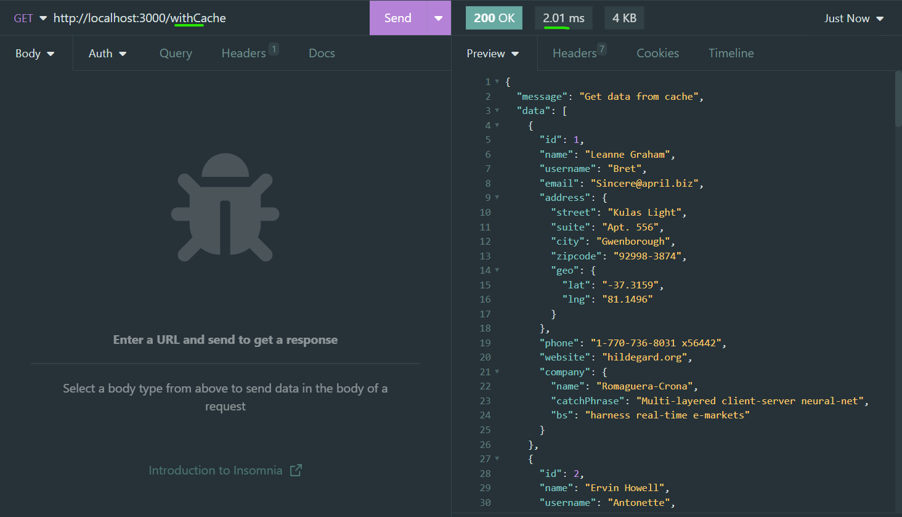
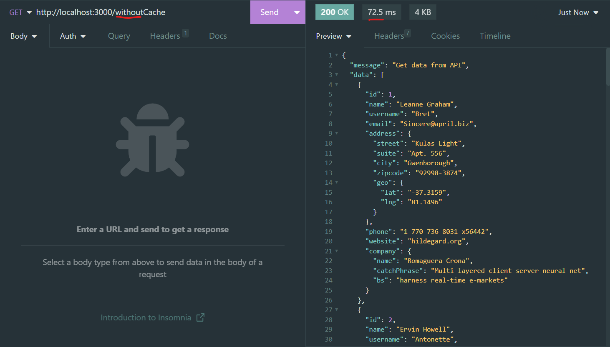

# node-redis

## Description

This is a simple project to test the performance of a node.js application with and without cache.

## Installation

```bash
npm install
```

## Usage

```bash
npm run dev
```

## Prints




## Dependencies

- [redis](https://ghub.io/redis): Redis client library
- [express](https://ghub.io/express): Fast, unopinionated, minimalist web framework
